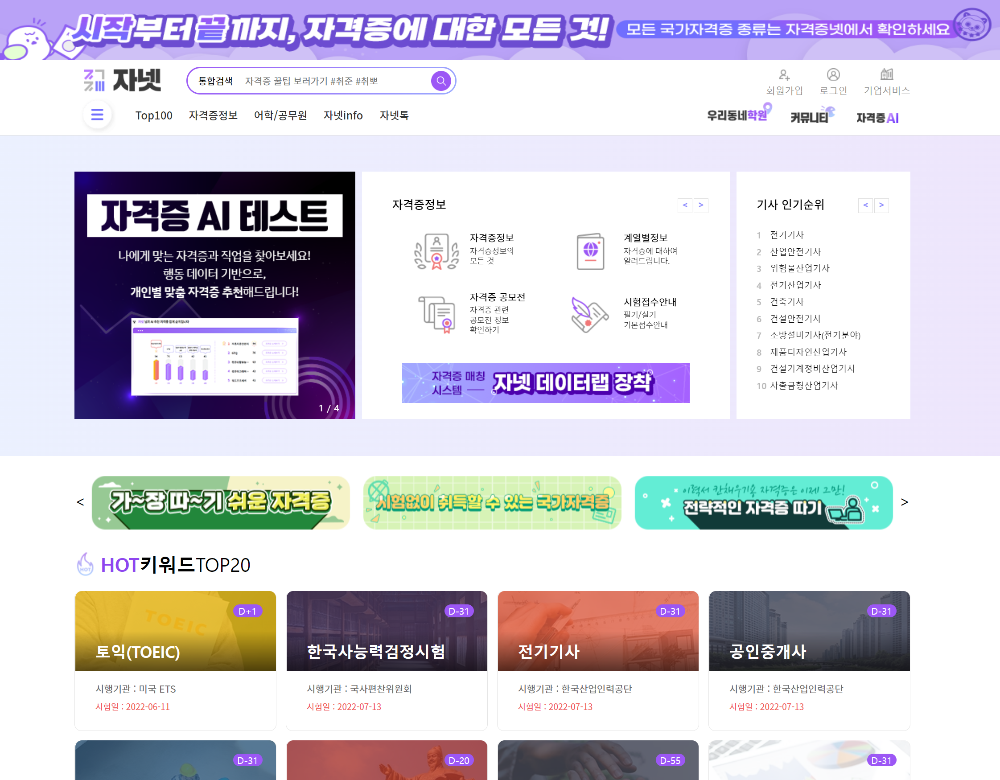

# NineApp



## 테스트 환경 세팅

### 1. [Node.js 설치](https://nodejs.org/en/download/)
Angular를 실행하려면 현재 활성 LTS 버전이거나 유지보수 중인 LTS 버전의 Node.js가 필요합니다.  
Angular 13.3.7 기준으로 필요한 "node" 버전은 아래중에 선택하면 됩니다.
```
>=12.20.0 & <13.0.0
>=14.15.0 & <15.0.0
>=16.10.0
```

### 2. 의존성 패키지 설치
- 해당 폴더에서 `npm i` 실행

### 3. 서버 실행
- `ng serve` 실행

### 4. 브라우저 접속(크롬 권장)
- URL 접속 `http://localhost:4200/`

## Angular version
- 13.3.11

## 폴더 구조
    .
    ├── ...
    ├── src                      # 워크스페이스 소스 파일
    │   ├── app                  # 프로젝트 로직과 데이터를 관리
    │   │    ├── contents        # 본문 내용
    │   │    │      └── main     # 메인 페이지 본문
    │   │    ├── footer          # 푸터
    │   │    ├── header          # 헤더
    │   │    └── app*.*          # 기본 메인 파일 (앱 최상위 컴포넌트)
    │   ├── assets               # 이미지 파일이나 리소스 파일
    │   ├── environments         # 환경에 맞게 적용될 빌드 환경설정 옵션 (개발/운영)
    │   └── ...
    └── ...


## 추가한 외부 파일
[normalize.css](https://necolas.github.io/normalize.css/)
- 브라우저 간 일관성을 위한 css

[reset.css](http://meyerweb.com/eric/tools/css/reset/)
- 브라우저 간 일관성을 위한 css

[swiper](https://github.com/nolimits4web/swiper)
- "swiper": "^8.2.2",

[폰트 추가](https://fonts.googleapis.com/css?family=Montserrat)
- Noto Sans KR
